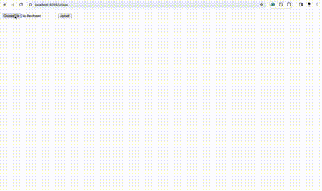

# Flask-on-Docker

## Overview

Flask-on-Docker is a containerized Flask application with Postgres for development and a production-ready setup using Gunicorn and Nginx to handle static and media files.

## Screenshot



## Getting Started

Follow these steps to set up and run the project locally.

### Prerequisites

- Docker
- Docker Compose

### Installation

1. Clone the repository
   ```bash
   git clone https://github.com/your-username/flask-on-docker.git
   cd flask-on-docker
   ```

2. Build the development image
    ```
    docker-compose up -d --build
    ```
3. Access the API endpoints at 
    ```
     http://localhost:8089
    ```
4. Usage
    upload image
    ```
    http://localhost:8089/upload
    ```
    display image
    ```
    http://localhost:8089/media/IMG_FILENAME
    ```

5. Production

    ```
    docker-compose -f docker-compose.prod.yml up -d --build
    ```


